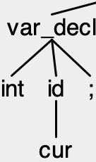

In this module,  you will be asked to build a compiler that can translate a simplified version of C, that we call *microC* (or *uC* for short), into a variant of [RiscV assembly](https://riscv.org). To do so, we will examine three steps of the compilation process:

1. **Building a parser.** You will learn how to use context-free grammars and regular expressions to specify a new language construct and keywords to add a new control structure (if-then-else) to our language.
2. **Generating code.** We will perform code generation for a version of RiscV that has an unlimited number of registers. In the first phase of code generation, you will learn to add *semantic actions* to your parser so it can build an *abstract syntax tree* (AST) for assignment statements and expressions, and then traverse that AST to generate code.
3. **Handling control structures.** We will then complete the code generation process for uC by adding support for generating code for control structures (while loops and  if-then-else statements).


# Step 2: ASTs and Code Generation
## Due: Sep 27th, 5 pm EDT (9 pm UTC)

## Setting up your repository

Set up your GitHub classroom repository for step 2 using [this link](https://classroom.github.com/a/7-bAqnG8)

Then clone your repository as directed in the cloning and submitting instructions

## Background

Having completed step 1, we have gotten to the point where the compiler can *parse* the program; it is able to build a parse tree that captures the structure of the program. So what now?

The next step is to use *semantic actions* to build up an intermediate representation for the program. A *parse tree* captures the *syntactic structure* of a piece of code. But what we're interested in is *what the code means*.

Semantic actions are steps that your compiler takes as the parser recognizes constructs in your program. Another way to think about this is that semantic actions are code that executes as your compiler matches various parts of the program (constructs like *variable declarations* or tokens like *identifiers*). By taking the right kind of action when the right kind of construct is recognized, you can make your compiler do useful work to build up its intermediate representation!

There are two key internal representations that our compiler will use. The first is a *Symbol Table* that records information about all of the symbols in the program. The second is an *Abstract Syntax Tree* that captures the structure of the program without worrying about the specific grammar rules that were used to create that structure (see the course notes for details about this).

### Symbol Tables

A symbol table holds information about all the symbols (variables, function names, strings, etc.) in a program. See the course notes for more details.

In the starter code, we have provided a basic symbol table for you that keeps track of the integer and string variables declared in the global scope (the only scope in the current version of uC). Becausse the variables are in global scope, the symbol table keeps track of the following information for them:

1. The name of the variable
2. The type of the variable (string or int)
3. The *address* of the variable (where in memory space the variable appears).

> In the simulator we will use for Risc-V (see below), global variables live in addresses in the range  `0x20000000` to `0x30000000`, and strings live in addresses in the range `0x10000000` to `0x20000000`. Strings are constant values, so are explicitly represented in the  program text.

One way to think about when to take actions in your parser is to think about associating actions with nodes of your parse tree. Each element in the parse tree can take an action to generate a semantic record for that node in the parse tree; these actions can include looking at the semantic records generated for the children in the parse tree. For example, consider the parse tree for the following piece of code:

```
int cur;
```

Which produces the following partial  parse tree:



We can create semantic records for the token `cur` "pass it up" the tree so that those records are the records for `id`. We can then construct a semantic record for `var_decl` using the semantic records of its children to produce a structure that captures the necessary information for an integer declaration entry in your symbol table (and even add the entry to the symbol table).

It may seem like a lot of work to keep track of pieces of data at each node of the parse tree and assemble them into more complicated records. But most parsers help do this *automatically*. As they build up the parse tree, they will call actions that execute to collect data from the parse tree and create semantic records. In essence, the parsers perform a post-order traversal of the parse tree as they walk the tree, and store information about the necessary semantic records in a way that you can easily retrieve them. Let's look at how this works for  ANTLR.

> It is worth remembering two things:
> 1. Tokens become leaves in the parse tree. The semantic record for a token is either always the text associated with that token.
> 2. Every symbol that shows up in a grammar rule will be a node in your parse tree, and that if you recognize a grammar rule, there will be a node in your parse tree associated with the left-hand-side of the rule and that node will have a separate child for each of the symbols that appear on the right hand side.

In ANTLR, you can put arbitrary Java code in braces (`{}`) at various points in the right hand side of a grammar rule in your `.g4` file; this code will execute as soon as the symbol immediately before the braces has been matched (if it's a token) or predicted and matched (if it's a non-terminal).

The "main" semantic action for a rule will go at the very end of the rule (in other words, it will execute once the entire rule has been matched). As part of this rule, you can assign a value to the semantic record that will be associated with the left hand side of the rule. You name the semantic record and tell ANTLR what type that record should have using a `returns` annotation.

You can then extract information from the semantic records of the children by giving variable names to the children you have matched. You can either access that child's semantic record by accessing `$a.x` where `a` is the name you gave the child and `x` is the name you gave to the child's semantic record in the `returns` annotation, or you can access the characters associated with the child (useful when matching tokens) with `$a.text`.

So let's see how we can use this process to create an entry in our symbol table for an integer declaration. (It will be helpful here to look at the starter  code for the symbol table, which is contained in `src/compiler/SymbolTable.java` and `src/compiler/Scope.java`).

```
var_decl : 'int' id ';' {st.addVariable(Scope.Type.INT, $id.text);};
```

So here we see that after recognizing a `var_decl` rule, we call the `addVariable` function of the symbol table to create a new variable with type `INT` and name `$id.text` (note how we're using `text` to get the actual characters the scanner saw when it matched an `id`). 

Note that the `SymbolTable` class contains some logic to automatically assign a memory location to global variables, and that memory location is also stored in the symbol table.

> Where did `st` come from? We created a member variable called `st` to hold the symbol table for the parser. You can see this in the `@members` block near the top of `MicroC.g4`. We also created a member function that allows the compiler to pass a symbol table in to the parser. See `src/compiler/Compiler.java` to see how this is done (lines 21 and 35).

### Abstract Syntax Trees

An Abstract Syntax Tree is essentially, a cleaned up form of your parse tree that more straightforwardly captures the structure of expressions, control constructs, etc. in your program. The course notes discuss the difference between an abstract syntax tree and a parse tree.

We have provided an Abstract Syntax Tree specification for you (see `src/ast`, with nodes corresponding to all the major constructs in the language (including some, like `IfStatementNode` and `WhileNode` that are not used in this step).

### Building an AST

Note that the information in the AST is associated with various nodes in the parse tree. We can use semantic actions, just as we did for the symbol table, to pass information "up" the parse tree to build up the AST. Instead of passing information about a declaration, we can instead pass partially constructed abstract syntax tree nodes.

For example, we can see how we can construct AST Nodes for `primary` expressions:

```
primary returns [ExpressionNode node] : id {$node = new VarNode($id.text);}
        | '(' expr ')' {$node = $expr.node;}
        | unaryminus_expr {$node = $unaryminus_expr.node;}
        | il = INT_LITERAL {$node = new IntLitNode($il.text);};
```

We see that `primary` `returns` an `ExpressionNode` called `node` -- this is an abstract AST Node type that has subclasses for particular `primary` expressions. When primary expands to an `id`, we can construct a `VarNode` and set it as the returned node for `primary`:

```
id {$node = new VarNode($id.text);}
```

This is essentially a base case for the recursion. To see what happens happens in a recursive case, consider what happens if `primary` is a parenthesized expression:

```
'(' expr ')' {$node = $expr.node;}
```

Here, we know that when the non-terminal `expr` is parsed, it will *already* have created an ASTNode representing that expression. So we can just "pass it up" the chain: `primary` will just return what `expr` already built.

We can also see how lists of statements can be built up:

```
statements returns [StatementListNode node] : statement s=statements {$node = new StatementListNode($statement.node, $s.node);}
            | /* empty */ {$node = new StatementListNode();};

statement returns [StatementNode node] : base_stmt ';' {$node = $base_stmt.node;}
```

So if `statements` is rewritten to lambda, we create an "empty" `StatementListNode`. If `statements` is rewritten to `statement statements`, we create a new `StatementListNode` by combining the `StatementNode` returned by `statement` with the `StatementListNode` returned by `statements.

> Note that we added an "alias" to `statements` in the first rule, calling it `s`. Now when we want to get information from that non-terminal, we can just refer to it as `s`. This is useful to shorten your code, but some times it is also necessary. Consider what happens if there are two non-terminals with the same name in a single rule.

### Generating assembly

Once we have an AST, generating Risc-V assembly is fairly straightforward. We can simply perform a walk of the AST as described in the course notes.

We have provided substantial starter code to make this task easier.

1. We provide an `AbstractASTVisitor` that simplifies the task of walking the AST. A visitor needs only to define the `preprocess` and `postprocess` methods for the AST nodes it cares about to take action. You can see `src/ast/visitor/PrintVisitor` for an example of such a visitor (that will also be helpful for debugging). By instantiating the type parameter `R` of `AbstractASTVisitor`, you can change what information is passed around as the AST is walked. The partial implementation `src/assembly/CodeGenerator` builds up `CodeObject`s.

2. We define `CodeObject`, the structure that will hold code. Recall from the class notes that the way to think about this is that a `CodeObject` holds the complete code for a particular AST sub-tree. To process a node in an AST, then, your task is to combine the `CodeObject`s from its children to form a new `CodeObject` that represents the entire tree.

3. We define classes for each Risc-V instruction you will need in `assembly/instructions`. A `CodeObject` will contain a list of these instructions, and printing this list out will print out the assembly code (see `src/compiler/Compiler` lines 52, 55, and 58).

Note that we have provided enough of `CodeGenerator` and `MicroC.g4` to let you correctly compile and generate code for test case 0 (in `tests/test0.uC`).

## What you need to do

We want you to fill in the rest of `CodeGenerator` and `MicroC.g4` to build an AST for expressions and assignment statements, and to generate code for those constructs.

> Pay careful attention to the `rvalify` method in `CodeGenerator`. This is a key method for correct code generation, as it is needed to generate r-values from l-values. Make sure you implement this correctly!

### Running your code

To run your code, you can use the Risc simulator we have provided for you. This is set up as a submodule in your git repo, which you can initialize by running:

```
> git submodule init
> git submodule update
```

Which will put the simulator code in the `RiscSim` directory.

> Because we have included this code as a submodule, if we ever update the simulator, you can simply run `git pull` in the `RiscSim` directory to get the updated simulator

You can run an assembly file by running:

```
> python3 RiscSim/driver.py [assembly file]
```

### Sample inputs and outputs

The test inputs we will use to test your program are in `tests`. We also have sample outputs in `outputs`. While your compiler may not produce exactly the same assembly as in `outputs`, the code you generate should produce the same results.

## What you need to submit

* All of the necessary code for building your compiler.

* A Makefile with the following targets:
    1. `compiler`: this target will build your compiler
    2. `clean`: this target will remove any intermediate files that were created to build the compiler

* A shell script (this *must* be written in bash, which is located at `/bin/bash` on the ecegrid machines) called `runme` that runs your scanner. This script should take in two arguments: first, the input file to the compiler  and second, the filename where you want to put the compiler's output. You can assume that we will have run `make clean; make compiler` before running this script, and that we will invoke the script from the root directory of your compiler.

While you may create as many other directories as you would like to organize your code or any intermediate products of the compilation process, both your `Makefile` and your `runme` script should be in the root directory of your repository.

*Do not submit any binaries*. Your git repo should only contain source files; no products of compilation.

See the submission instructions document for instructions on how to submit. You should tag your step 2 submission as `submission`